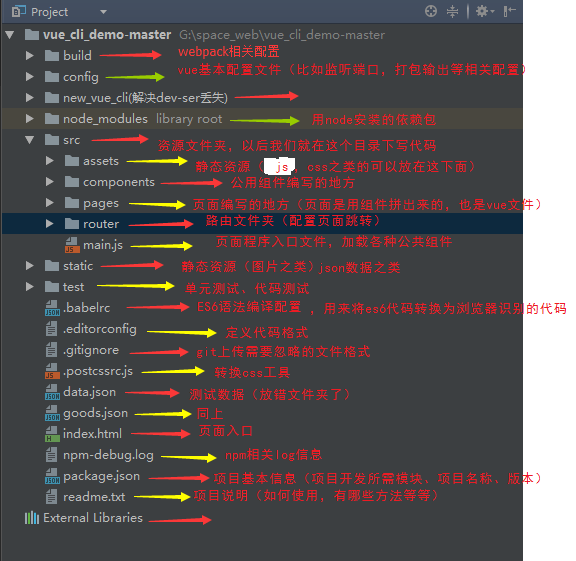
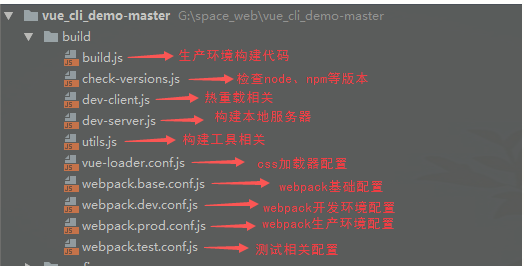
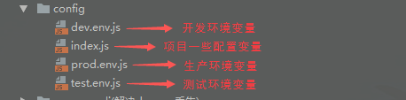

### 一、创建vue项目

* 前提：node环境，cnpm镜像

1. 安装Vue-Cli：    npm i -g vue-cli

2. 初始化项目： vue init webpack XXX（你想要项目的名字）

3. 一路回车

4. 安装依赖：cnpm install

5. 运行项目：npm run dev

### 二、结构目录一览表

1. 整个项目目录结构

2. build目录结构

3. build目录结构(环境变量)

