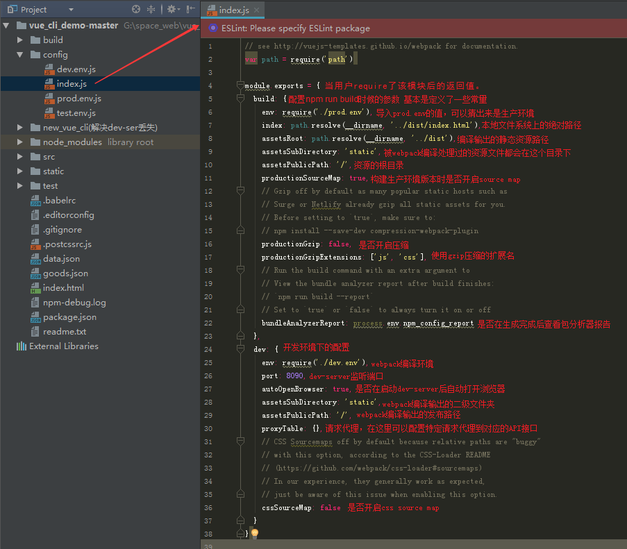

### 一、创建vue项目

* 前提：node环境，cnpm镜像

1. 安装Vue-Cli：    npm i -g vue-cli

2. 初始化项目： vue init webpack XXX（你想要项目的名字）

3. 一路回车

4. 安装依赖：cnpm install

5. 运行项目：npm run dev

### 二、结构目录一览表

1. 整个项目目录结构

2. build目录结构

3. build目录结构(环境变量)

4. 
* index.html:只有一个空的根节点，src/main.js 下实例将挂载到#app节点下，内容被vue组件替换。
* src/App.vue:项目主组件。
* src/main.js:入口文件，初始化vue实例并使用需要的插件。
* router/index.js:定义路由。

5. build文件夹详解
* build.js，作用：run build的入口配置文件，用于生产环境

* check-versions.js 作用：node，npm版本号

* utils.js 作用：处理css-loader和vue-style-loader

* webpack.base.conf.js 作用：cssloadeer构建配置

6.package.json
package.json中最重要的属性是name和version两个属性，这两个属性是必须要有的，否则模块就无法被安装，这两个属性一起形成了一个npm模块的唯一标识符。

7.config文件详解

condig文件夹中的其他几个文件，这几个文件主要是暴露接口（其他文件会引用这些暴露出来的变量等）

8..babelrc文件：由于浏览器的兼容问题，很多js新方法都不能用，babel因此而生。它可以将这些新方法编译成兼容的代码，尽量多的适应主流浏览器。

9..editorconfig文件配置：用来规范开发中缩进风格的统一

10..postcssrc.js文件：postCss提供一个解析器，将css解析成抽象语法树。